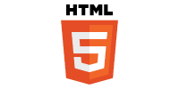
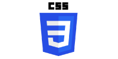
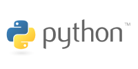
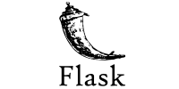

## Hi there, I'm Jessica 👋🏾

I'm passionate about developing beautiful websites with an outstanding UX. I'm currently completing a Diploma in Full Stack Software Development at the Code Institute and I hope you enjoy browsing through some of my recent projects 👩🏾‍💻 

### My Toolbox

      

____

**Check out my latest projects below 👇🏾**
