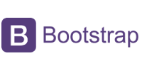

# 👋🏽 Hello World, I'm Jess! 🌍

## About Me:

🙋🏾‍♀️ Hi I'm Jessica, but you can call me Jess!

🖥️ I'm passionate about developing beautiful websites with an outstanding UX. 

👩🏾‍💻 I'm currently working as a Frontend Web Developer for a luxury jewellery brand and recently completed a Diploma in Full Stack Software Development at the <a href="https://codeinstitute.net">Code Institute</a>.

🌟 Fun fact: I'm a career switcher from Marketing to Coding, so I have a super charged skillset!

____

### My Toolbox

       

____

**Check out my latest projects below 👇🏾**
